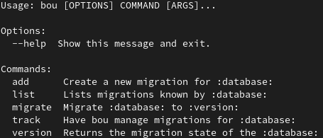

# Bou

A sqlite migrations manager in the spirit of [caribou](https://github.com/clutchski/caribou).

First time users might be interested in the [Project Glossary](docs/glossary.md).

If you're looking at this, in it's current state, congratulations!
You found this in a state I considered worth putting on github so I don't lose it.

Mind the dust. Feature completeness, proper documentation, code linting and so forth coming eventually.

## With thanks to ...

* clutchski's [caribou](http://github.com/clutchski/caribou) for initial inspiration.
* The [click](https://click.palletsprojects.com/) library for it's CLI goodness.
* The [jinja](https://jinja.palletsprojects.com/) templating library for output.

